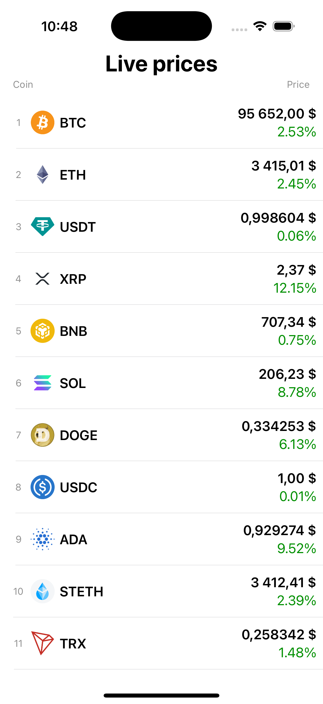
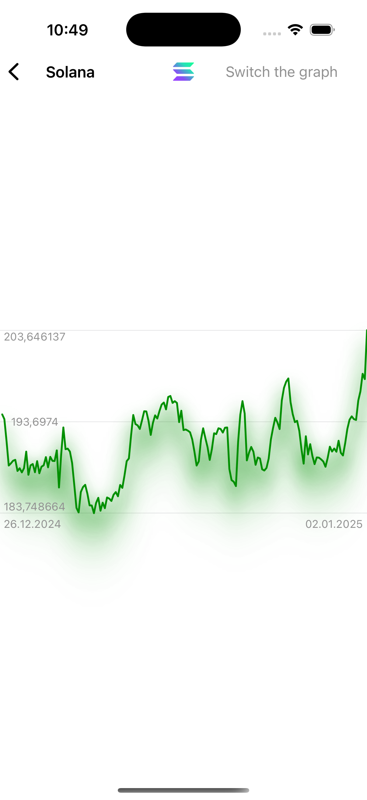
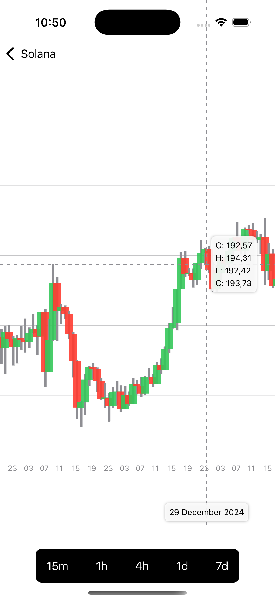

# CoinTrack

CoinTrack is an iOS app for tracking cryptocurrency prices with real-time candlestick charts. The app integrates CoinGecko API for historical data and Binance WebSocket for real-time updates.

---

## ⚙️ Features

- **Real-time chart updates** via Binance WebSocket.
- **Historical data** powered by CoinGecko API.
- **Interval selection** for viewing candles
- User-friendly and minimalistic interface.

---

## 🛠️ Technologies Used

- **Programming Language:** Swift
- **Frameworks:** SwiftUI, Combine, Charts
- **APIs:** CoinGecko REST API, Binance WebSocket
- **Architecture:** MVVM

---

## 🖼️ Screenshots

  
  

---

## 📚 Additional Resources

- CoinGecko API [Documentation](https://www.coingecko.com/en/api/documentation)
- Binance API [Documentation](https://binance-docs.github.io/apidocs/spot/en/)
- WebSocket [Documentation](https://developer.apple.com/documentation/foundation/urlsessionwebsockettask)

---

## 📞 Contact

**Developer:** [Ivan Kostyrka](mailto:ivan.kostyrka.work@gmail.com)  
**LinkedIn:** [linkedin.com/in/ivan-kostyrka-54342b324](https://www.linkedin.com/in/ivan-kostyrka-54342b324/)  

## 🚀 Installation

   ```bash
   git clone https://github.com/1kostyrka/CoinTrack.git
   open ios-crypto.xcworkspace
